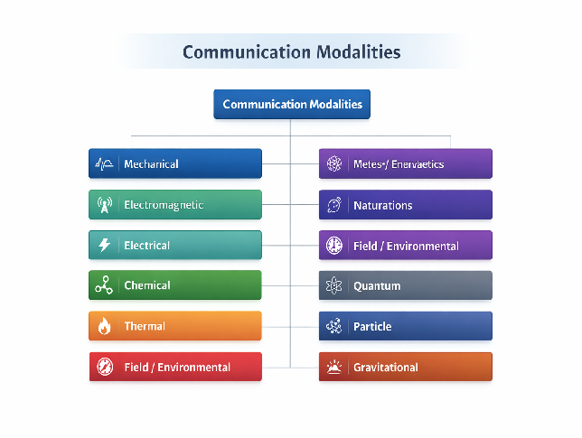

# VarCom

# **VarCom: A Unified Theory of Communication as Intentional, Encoded Variation**

---

## **Abstract**

This paper introduces **Variation Communication Theory (VarCom)**, a unified framework defining communication as the **intentional production of encoded variation for potential reception**. Unlike classical models, including Shannon’s information theory, which emphasize successful transmission and reception, VarCom distinguishes between the **existence of communication** and its **successful detection or interpretation**. Communication is treated as a sender-side phenomenon grounded in the modulation of measurable variables, independent of receiver presence. The framework integrates physical modalities, signal forms, encoding, and information flow into a unified ontology applicable across biological, technological, and environmental systems. VarCom proposes that any controllable and detectable variable can serve as a communication channel, thereby generalizing communication beyond language and conventional signaling systems.

---

## **1\. Introduction**

Communication is traditionally framed as the transfer of information between a sender and receiver. However, this framing implicitly assumes successful reception, which is not necessary for communication to occur. Signals are routinely produced without receivers, such as unattended alarms, broadcast transmissions, or biological signals emitted in uncertain environments.

This paper proposes a revised definition:

> **Communication \= intentional, encoded variation produced for potential reception**

This definition separates communication from reception and aligns it with the act of signal production. It extends existing frameworks by grounding communication in physical variation while maintaining independence from specific modalities or media.

---

## **2\. Theoretical Foundation**

### **2.1 Communication as Variation**

All communication involves:

* a **variable** (e.g., pressure, light intensity, chemical concentration)  
* a **structured variation** in that variable  
* an **encoding** that maps variation to meaning  
* an **intentional emitter**

---

### **2.2 Core Distinction**

Variation  
├── Communication (intentional, encoded)  
└── Environmental Variation (non-intentional)

---

### **2.3 Key Principle**

> Communication is defined by **intent and encoding**, not by successful reception.

---

## **3\. Formal Definition**

### **3.1 Communication**

> **Communication is the intentional production of encoded variation in a variable for potential detection by a receiver.**

---

### **3.2 Supporting Definitions**

* **Variable**: a measurable property capable of change  
* **Signal**: the physical realization of variation  
* **Encoding**: mapping from variation to meaning  
* **Reception**: detection of variation  
* **Interpretation**: extraction of meaning

---

## **4\. Information Flow Model**

### **Figure 1 — Information Flow**

### **Key Insight**

* Communication occurs at **Emission**  
* Later stages are **optional outcomes**

---

## **5\. Communication Modalities**

Communication occurs across multiple physical modalities:

### **Figure 2 — Modalities**

Communication Modalities  
├── Mechanical  
├── Electromagnetic  
├── Electrical  
├── Chemical  
├── Thermal  
├── Field / Environmental  
├── Quantum  
├── Particle  
├── Gravitational  
├── Plasma  
└── Material / Structural

---

### **5.1 Interpretation**

These modalities represent **classes of variables**, not separate theories.  
The same message can be encoded across different modalities.

---

## **6\. Signal Forms**

### **Figure 3 — Signal Forms**

Signal Form  
├── Wave (oscillation)  
├── Flow (movement)  
├── Contact (direct interaction)  
└── State (static configuration)

---

### **6.1 Cross-Modality Consistency**

Each modality supports multiple forms:

* Mechanical → sound (wave), touch (contact)  
* Chemical → smell (flow), taste (contact)  
* Thermal → radiation (wave), heat (contact), temperature (state)

---

## **7\. Encoding and Modulation**

### **7.1 Encoding**

Defines meaning structure.

### **7.2 Modulation**

Defines how variation is shaped:

* amplitude  
* frequency  
* timing  
* pattern  
* quality

---

### **Figure 4 — Modulation Layer**

Signal  
└── Modulated by  
    ├── Amplitude  
    ├── Frequency  
    ├── Timing  
    ├── Pattern  
    └── Quality

---

### **7.3 Paralinguistics**

Paralinguistic features (tone, posture, breathing) are **modulation layers**, not separate communication modalities.

---

## **8\. Storage vs Transmission**

### **Figure 5 — State vs Change**

Information  
├── Storage (state)  
└── Transmission (change)

---

### **Interpretation**

* Storage → stable configuration (books, memory)  
* Transmission → dynamic variation (speech, signals)

---

## **9\. Unified Communication Model**

### **Figure 6 — Full System**

Emitter  
  ↓ (intentional encoding)  
Encoded Variation (Message)  
  ↓  
Signal (physical realization)  
  ↓  
Carrier (medium)  
  ↓  
Receiver (optional)  
  ↓  
Interpretation (optional)  
  ↓  
Reaction (optional)

---

## **10\. Discussion**

### **10.1 Key Contributions**

VarCom introduces:

* separation of **communication vs reception**  
* a unified framework across all physical modalities  
* inclusion of **non-propagating communication** (contact, state)  
* separation of:  
  * modality  
  * signal form  
  * modulation

---

### **10.2 Relation to Existing Work**

VarCom extends:

* Shannon’s signal-channel model  
* Landauer’s physical grounding of information

by integrating them into a unified, modality-independent system.

---

### **10.3 Implications**

* Communication is broader than language  
* Applies to biological, artificial, and environmental systems  
* Suggests unexplored communication channels

---

## **11\. Conclusion**

VarCom provides a unified theory of communication grounded in intentional, encoded variation. By separating communication from reception and organizing communication across modalities and signal forms, it establishes a general framework for understanding how systems influence one another.

> **Communication is the act of producing meaningful variation, independent of whether it is received.**

> 

# **12\. Case Studies: Communication Across Modalities**

**This section demonstrates the applicability of VarCom across biological and engineered systems. Each case illustrates intentional, encoded variation, independent of successful reception, and distinguishes communication from mere environmental perception.**

---

## **12.1 Human Speech (Mechanical, Wave)**

### **Description**

**Human speech involves the intentional modulation of air pressure via vocal tract dynamics.**

### **VarCom Mapping**

* **Emitter: Human speaker**  
* **Variable: Air pressure**  
* **Modality: Mechanical**  
* **Form: Wave**  
* **Encoding: Language \+ paralinguistic modulation**  
* **Carrier: Air**

### **Analysis**

**Speech satisfies all criteria for communication:**

* **Intentional: The speaker intends to convey meaning**  
* **Encoded: Linguistic structure and modulation encode information**  
* **Independent of reception: Speech occurs even if no listener is present**

---

## **12.2 Ant Pheromone Trails (Chemical, Contact)**

### **Description**

**Ants deposit chemical trails that guide other ants to resources.**

### **VarCom Mapping**

* **Emitter: Ant**  
* **Variable: Chemical concentration on surface**  
* **Modality: Chemical**  
* **Form: Contact (surface-based)**  
* **Encoding: Trail strength and pattern**  
* **Carrier: Ground surface**

### **Analysis**

* **Communication exists at the moment of deposition**  
* **Detection may occur later or not at all**  
* **No propagation is required**

**This demonstrates non-propagating communication via stored variation.**

---

## **12.3 Electric Fish Signaling (Electrical, Field)**

### **Description**

**Certain fish emit electric fields to communicate with others.**

### **VarCom Mapping**

* **Emitter: Electric fish**  
* **Variable: Electric field intensity and timing**  
* **Modality: Electrical**  
* **Form: Field modulation**  
* **Encoding: Pulse patterns**  
* **Carrier: Water**

### **Analysis**

* **Signals are intentionally generated**  
* **Encoding is species-specific**  
* **Detection depends on specialized receptors**

**This illustrates communication via non-contact, non-wave field variation.**

---

## **12.4 Human Gesture and Posture (Electromagnetic, Visual)**

### **Description**

**Humans use body movement and posture to communicate meaning.**

### **VarCom Mapping**

* **Emitter: Human**  
* **Variable: Light patterns reflected from body**  
* **Modality: Electromagnetic**  
* **Form: Visual pattern**  
* **Encoding: Cultural and biological cues**  
* **Carrier: Light**

### **Analysis**

* **Includes both structured systems (sign language) and informal signals (gesture)**  
* **Paralinguistic modulation (speed, posture, intensity) plays a key role**

---

## **12.5 Written Text and Braille (Material, State)**

### **Description**

**Information is stored in physical configurations for later detection.**

### **VarCom Mapping**

#### **Written Text:**

* **Variable: Surface markings**  
* **Modality: Electromagnetic (visual detection)**  
* **Form: State**  
* **Carrier: Surface**

#### **Braille:**

* **Variable: Raised features**  
* **Modality: Mechanical**  
* **Form: Contact / State**  
* **Carrier: Surface**

### **Analysis**

* **Communication occurs at the moment of encoding**  
* **Reception is delayed and optional**  
* **Demonstrates storage as communication extension**

---

## **12.6 Electric and Digital Systems (Electrical, Flow)**

### **Description**

**Computers encode and transmit information via electrical signals.**

### **VarCom Mapping**

* **Emitter: Circuit**  
* **Variable: Voltage/current**  
* **Modality: Electrical**  
* **Form: Flow**  
* **Encoding: Binary**  
* **Carrier: Wire**

### **Analysis**

* **Highly structured encoding**  
* **Designed for reliable transmission**  
* **Clear separation between communication and reception**

---

## **12.7 Communication vs Environmental Perception**

### **Contrast Case**

| Scenario | Classification |
| ----- | ----- |
| **Person speaks** | **Communication** |
| **Ant lays trail** | **Communication** |
| **Feeling heat from fire** | **Perception** |
| **Smelling random odor** | **Perception** |

### **Key Insight**

* **Heat and smell can be used for communication, but are not inherently communicative**  
* **Communication depends on intentional encoding, not modality**

---

## **12.8 Speculative Modalities (Future Systems)**

**VarCom predicts that any controllable variable could be used for communication.**

### **Potential Systems:**

* **Quantum communication (state encoding)**  
* **Gravitational signaling (spacetime variation)**  
* **Particle communication (neutrino streams)**

### **Interpretation**

**These may appear implausible, but:**

> **Communication capability is determined by detectable variation, not familiarity.**

---

# **💎 Section Summary**

**Across all case studies:**

* **Communication is intentional and encoded**  
* **Reception is optional**  
* **Modalities vary, but structure remains consistent**  
* **The same principles apply across biology, technology, and hypothetical systems**

## 

## **References**

Landauer, R. (1961). Irreversibility and heat generation in the computing process. *IBM Journal of Research and Development, 5*(3), 183–191.

Shannon, C. E. (1948). A mathematical theory of communication. *Bell System Technical Journal, 27*(3), 379–423.

Maxwell, J. C. (1865). A dynamical theory of the electromagnetic field. *Philosophical Transactions of the Royal Society of London, 155*, 459–512.

Wiener, N. (1948). *Cybernetics: Or control and communication in the animal and the machine*. MIT Press.
