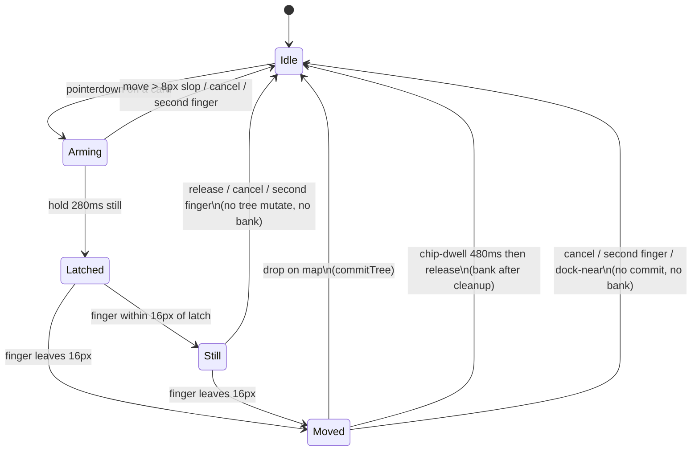

# LOGYQ mobile hold-drag states

Phone only (`logyq-mobile-v162`). Finger grammar: flick create / 280ms hold-drag / 360ms double-tap edit. This page is hold-drag only.



```
idle
  │ pointerdown on card
  ▼
arming (280ms, 8px slop)
  │ hold still 280ms
  ▼
latched  ──clone lifts 1.1cm; origin ghost; layout frozen──
  ├─ still (≤16px) ──release / cancel / 2nd finger──► idle
  │                    no splice, no bank, map unmoved
  └─ moved (>16px)
       ├─ release on map ──────── commitTree ──► idle
       ├─ chip inner 44% + 480ms ─ bank after cleanup ──► idle
       └─ cancel / 2nd finger / dock-near ──► idle (no commit)
```

## Invariants

| Rule | How |
|---|---|
| Origin keeps layout space until commit | `holdDragFrozen()` while `body.v2-branch-drag` and `__logyqHoldDragCommit` unset. `layoutAndRender` and bank splices no-op. Gestures set the commit flag only for a real move-drop. |
| Stay-still never banks | `activeDockKind` is `none` until `STILL_PX` (16). `addWords` / contextmenu no-op unless `__logyqHoldDragAllowBank`. That flag is set only for move + chip + 480ms dwell. |
| Map does not jump on latch | No `shiftMapOnLatch`. Clone uses `fingerOffset` `{0, -1.1cm}`; d3 is not fed that offset until the finger leaves `STILL_PX`. |
| 1.1cm lift is clone-only | `#logyq-v162-branch-preview` follows the finger + lift. Live `g.node` stays in its cell as a dashed ghost (`v2-branch-origin-ghost`). |
| Hold-drag pan is center-offset | Finger offset from the viewport center, after a 56px dead zone. Content leash leaves ~⅓ viewport empty on the leading edge. |

## Thresholds

`HOLD_MS` 280 · `HOLD_SLOP` 8 · `STILL_PX` 16 · `OFFSET_UP_CM` 1.1 · `BANK_DWELL_MS` 480 · chip hit = inner 44% inset 8px.
