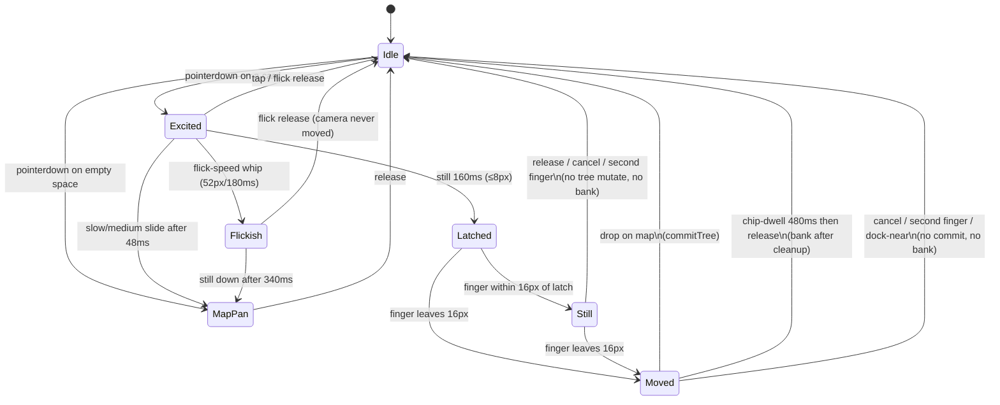

# LOGYQ mobile hold-drag states

Phone only (`logyq-mobile-v162`). Card contact is a 3-way race: flick create / 160ms hold-drag / slow map-pan.



```
idle
  │ pointerdown on card ── zoom suppressed (__logyqSuppressZoom)
  ▼
excited (HOLD_MS 160, HOLD_SLOP 8)
  ├─ still 160ms ────────────────► latched (stop zoom; clone lifts)
  ├─ slow/medium slide ──────────► map-pan from *now* (no backfill)
  │     dist > 8, elapsed ≥ 48, recent speed < 52px/180ms
  ├─ flick-speed whip ───────────► flickish (zoom stays suppressed)
  │     recent/peak ≥ 52px/180ms, or release 52px / ≤340ms / 1.45
  │     create; camera never moved
  └─ release ≤11px ────────────── tap / double-tap / paint
```

## Invariants

| Rule | How |
|---|---|
| Origin keeps layout space until commit | `holdDragFrozen()` while `body.v2-branch-drag` and `__logyqHoldDragCommit` unset. `layoutAndRender` and bank splices no-op. Gestures set the commit flag only for a real move-drop. |
| Stay-still never banks | `activeDockKind` is `none` until `STILL_PX` (16). `addWords` / contextmenu no-op unless `__logyqHoldDragAllowBank`. That flag is set only for move + chip + 480ms dwell. |
| Map does not jump on latch | No `shiftMapOnLatch`. Clone uses `fingerOffset` `{0, -1.1cm}`; d3 is not fed that offset until the finger leaves `STILL_PX`. |
| 1.1cm lift is clone-only | `#logyq-v162-branch-preview` follows the finger + lift. Live `g.node` stays in its cell as a dashed ghost (`v2-branch-origin-ghost`). |
| Hold-drag pan is center-offset | Finger offset from the viewport center, after a 56px dead zone. Content leash leaves ~⅓ viewport empty on the leading edge. |
| Card race does not jerk on flick | Zoom is suppressed until the stroke is classified. Flick-speed never applies pan. Slow/medium pan starts from the current finger (no backfill). Hold latch still calls `stopZoomGesture`. |

## Thresholds

`HOLD_MS` 160 · `HOLD_SLOP` 8 · `FLICK_MIN` 52 · `FLICK_MAX_MS` 340 · `FLICK_RATIO` 1.45 · `FLICK_FAST_MS` 180 · `STILL_PX` 16 · `OFFSET_UP_CM` 1.1 · `BANK_DWELL_MS` 480 · chip hit = inner 44% inset 8px.
